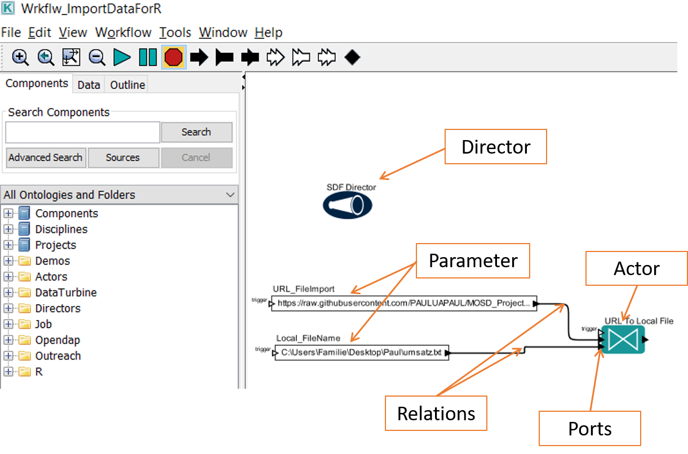

# 2. Basic Interaction with Kepler

In this part of the workshop it is getting serious. You will get in touch with **Kepler**, a software to construct and execute complex scientific workflows.

**Kepler scientific workflow system** was founded back in 2002 and is an open-source, free cross-platform (Windows, Linux, Mac) program. It is designed to create, execute, share models and analyses across a broad range of scientific and engineering disciplines ([Kepler]https://kepler-project.org/). Kepler uses a drag-and-drop interface for scientists to construct their workflows and it can operate on data stored in a variety of formats, locally and over the internet. For computer scientists and of course also scientists from other fields,it is interesting that Kepler directly supports Python, R, Java, Javascript and even compiled C-Code. That means you can code directly inside the Kepler software. You will learn more about it in the next [chapter](./kepler_case_study.md)

Every workflow must have a **director**, and he controls the execution of the workflow. Each step in a workflow is represented by an **actor**. That means each analysis or data manipulation task is represented as an actor in Kepler. All actors are controlled by a director.
An actor has at least one **port**. A port can be either a input, output or input/output port and is used to consume or produce data. Between different actors are connections, that are called **relations**. They connect an output port from a actor or **parameter** with an input port from another. In the following picture you can see all the components.

To select or connect different components Kepler provides a simple drag and drop interface. For further information see [Kepler Getting Started](https://code.kepler-project.org/code/kepler-docs/trunk/outreach/documentation/shipping/2.5/getting-started-guide.pdf) and [Kepler User Manual](https://code.kepler-project.org/code/kepler-docs/trunk/outreach/documentation/shipping/2.1/UserManual.pdf).

You can [download](https://kepler-project.org/users/downloads.html) the latest version for you operating system of choice under

[>> 3. Case Study with Kepler](./kepler_case_study.md)
